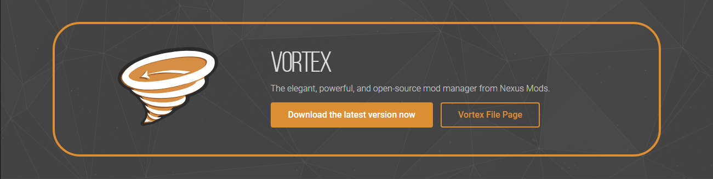
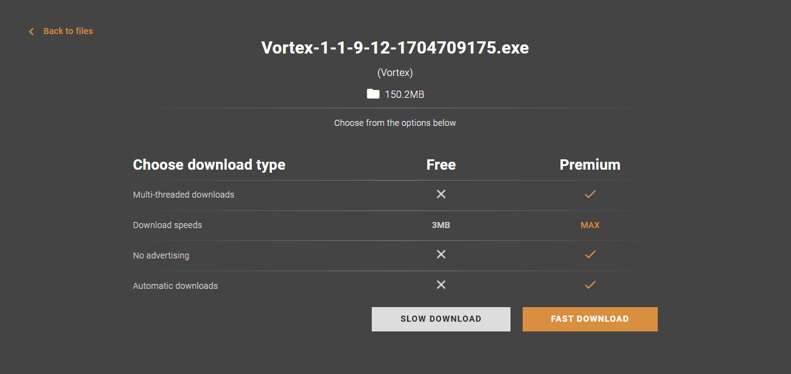
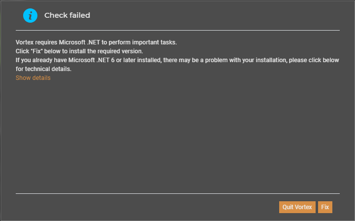
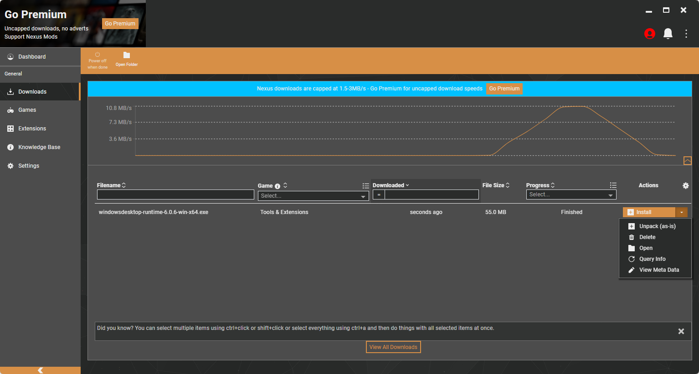
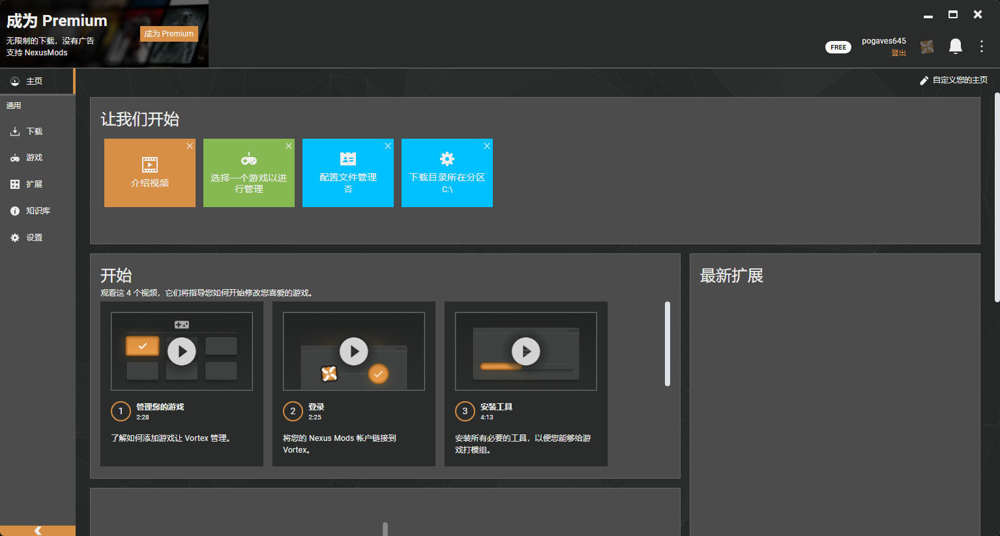
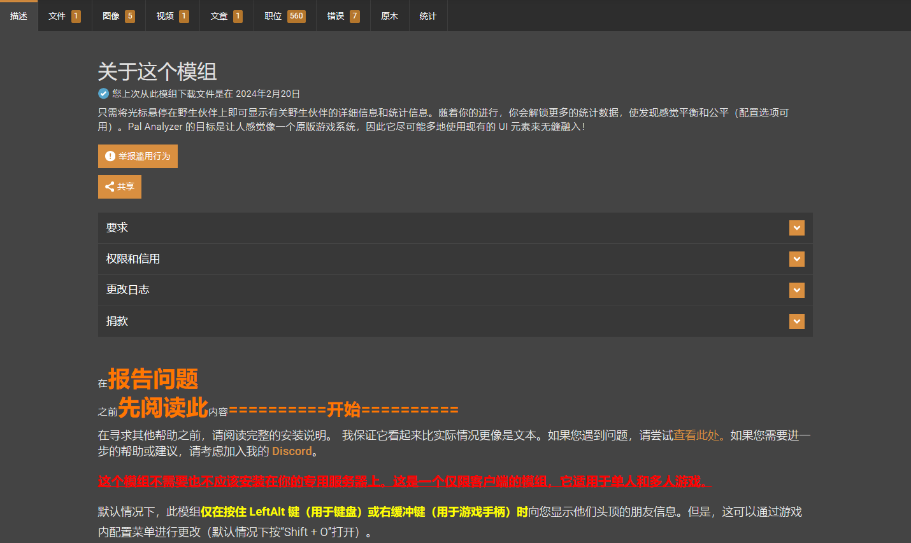
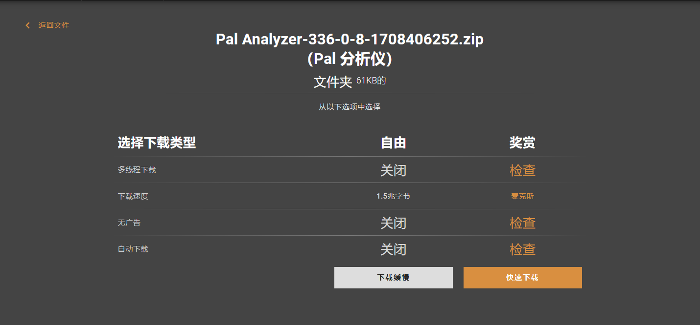
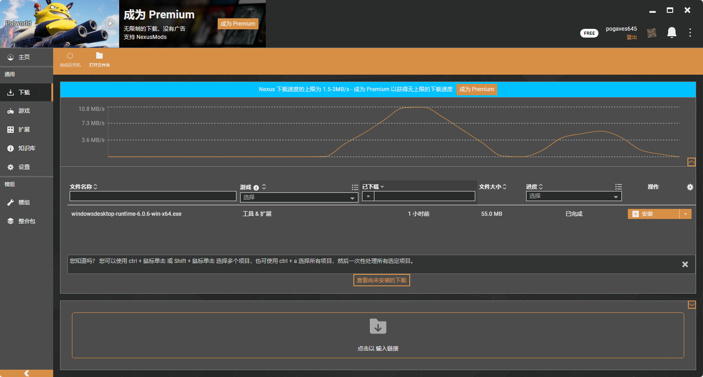

# Palworld MOD安装教程

[TOC]

<blockquote alt="info">
    

        Vortex演示版本： 1.9.12
        汉化演示版本：1.9.13
        幻兽帕鲁扩展演示版本：0.1.7
        MOD演示编号：336
        UE4SS：3.0.1
    

</blockquote>
<blockquote alt="warn">
因国内网络问题，Nexus mods、GitHub可能无法访问。
</blockquote>

可使用  [Watt Toolkit「原名 Steam++」](https://steampp.net/) 加速网页。

## 1、MOD下载网站（N网）

https://www.nexusmods.com

> 因网站限制，必须登录才能下载文件。

## 2、Vortex MOD管理器安装教程

> 方便后续安装更多MOD和管理MOD。

### 1.下载Vortex

**下载地址：https://www.nexusmods.com/about/vortex**

**登录地址：https://users.nexusmods.com**

**注册地址：https://users.nexusmods.com/register**

**如不常下载或不想使用自己的邮箱，可使用 [Temp Mail - 临时邮件](https://mail.tm/zh/) 或其他匿名邮箱。**

点击 <kbd>**Download the latest version now**</kbd> 。

点击右下角 <kbd>**MANUAL**</kbd> 。

点击 <kbd>**DOWNLOAD**</kbd> ，前置可以不必理会，缺失会自动下载补齐。

点击 <kbd>**SLOW DOWNLOAD**</kbd> ，等待五秒后会自动下载。下载完成后安装Vortex，安装过程不再赘述。

### 2.汉化Vortex

下载地址：https://www.nexusmods.com/site/mods/29

点击右下角 <kbd>**MANUAL**</kbd> 下载。

> 下载完成自行解压。

双击 <kbd>**汉化安装脚本**</kbd> ，按照提示完成汉化。完成后，重新打开Vortex。

若弹出此界面，点击 <kbd>**Fix**</kbd> 会自动下载.NET6。

下载完成后点击 <kbd>**Open**</kbd> 。

点击 <kbd>**安装**</kbd> 。

点击左侧 <kbd>**Settings**</kbd> ，找到 <kbd>**Language**</kbd> ，选择 <kbd>**中文(zhōng wén),汉语,漢語**</kbd> ，完成后重启Vortex以便完全汉化。

## 3、使用Vortex安装MOD

### 1.登录Vortex

点击右上角红色头像。

在弹出网页页面点击 <kbd>**Authorise**</kbd> 。

点击 <kbd>**Log in to Vortex**</kbd> 。

等待一段时间，如没有反应，再重复以上步骤。

### 2.安装Palworld Vortex Extension扩展

扩展链接：https://www.nexusmods.com/site/mods/770

下载链接：https://www.nexusmods.com/site/mods/770?tab=files&file_id=2779

> 下载方法同上（使用手动下载）。

下载完成将下载的 <kbd>**Palworld Vortex Extension-770-0-1-7-1708434866.zip**</kbd> 拖动到右下角 <kbd>**拖入文件**</kbd> ，安装完成后点击重启。

<blockquote alt="danger">
无法拖入可手动安装。
</blockquote>

找到 <kbd>**游戏**</kbd> - <kbd>**Palworld**</kbd> - <kbd>**点击管理或激活**</kbd> 。完成后重启Vortex。

<blockquote alt="danger">
正常会自动搜索到游戏路径。如没有安装，则必须手动设置游戏路径。
</blockquote>

### 3.安装MOD

Pal Analyzer 下载地址：https://www.nexusmods.com/palworld/mods/336

<kbd>**DESCRIPTION**</kbd> 为描述内容，可使用浏览器自带翻译或其他翻译扩展。

点击左侧 <kbd>**模组管理器下载**</kbd> 。

点击 <kbd>**下载**</kbd> 。

点击 <kbd>**下载缓慢**</kbd> 。

点击 <kbd>**打开Vortex**</kbd> 。

下载完成后会自动安装部署。

### 4.安装UE4SS

<blockquote alt="danger">
如未自动安装UE4SS，则需手动下载安装。如已自动安装请忽略。
</blockquote>

安装方法一：手动下载安装

下载地址：https://github.com/UE4SS-RE/RE-UE4SS/releases

选择： <kbd>**zDEV-UE4SS_v3.0.1.zip**</kbd> 或其他版本。

下载完成后将 <kbd>**zDEV-UE4SS_v3.0.1.zip**</kbd> 拖入。

点击 <kbd>**安装全部**</kbd> 。

方法二：手动下载自动安装

点击 <kbd>**输入链接**</kbd> 。

https://github.com/UE4SS-RE/RE-UE4SS/releases/download/v3.0.1/zDEV-UE4SS_v3.0.1.zip

点击 <kbd>**下载**</kbd> 。

等待自动安装完成。

[Steam 上的 Palworld / 幻兽帕鲁 (steampowered.com)](https://store.steampowered.com/app/1623730/Palworld/)

[Palworld Nexus 的模组 - 模组和社区 (nexusmods.com)](https://www.nexusmods.com/palworld/mods)

[欢迎来到 Steam (steampowered.com)](https://store.steampowered.com) 或 https://s.team

别再搞错“盗版、假冒”等错误网站了。

[Palworld | Pocketpair, Inc.](https://www.pocketpair.jp/palworld?lang=zh)

[Discord](https://discord.com/invite/pocketpair)

[Palworld幻兽帕鲁的个人空间-Palworld幻兽帕鲁个人主页-哔哩哔哩视频 (bilibili.com)](https://space.bilibili.com/1204574558)

<iframe src="https://store.steampowered.com/widget/1623730" frameborder="0" width="646" height="190"></iframe>

编写于：2024年02月19日  --  修订于：2024年02月21日